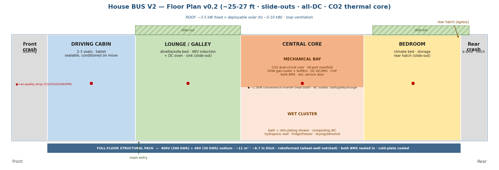

# Bus Layout & Floor Plan - V2 (integrated bus)

**Status:** Layout v0.2 (firmed-footprint pass)  ·  **Applies to:** Bus **V2** (the bespoke integrated House Bus; V1 = the skoolie repower has its own simpler layout)  ·  **Depends on:** all subsystem tracks + the V1-vs-V2 staging
**Part of:** House BUS subsystem design tracks. Where the now-sized components become a physical arrangement.

---

## 1. Purpose & what changed since v0.1

v0.1 was the first arrangement from the basic subsystem pass. **v0.2 folds in the footprints that have since firmed up:**
- **400 V / 48 V dual-domain structural pack** (~330 kWh: 300 @ 400 V traction + 30 @ 48 V house) - *was* 800 V single pack. Both BMS sealed inside; **roboformed enclosure**, wheel-well-notched; **~11 m^2 single-layer footprint, ~8.7 in thick**; cold-plate cooled off the thermal loop.
- **CO2 dual-circuit thermal core** in the central bay (high-temp 400 V CO2 compressor + low-temp 48 V Secop; gas cooler -> hot water; 18-port manifold; hot/cold buffers; CHP genset).
- **All-DC electrical** - no main 5 kW inverter; 48 / 24 / 12 V + USB-C via point-of-use bucks; a small **~1.5 kW switchable convenience inverter near the bathroom** feeds AC outlets at bath/galley/lounge; galley cooking = **48 V DC induction + DC oven**.

Dimensions are firmer but still provisional; the goal remains the arrangement and its logic.

## 2. The floor plan

Front (cab) at left, rear (bed) at right. **~25-27 ft x ~8 ft body**, slide-outs widening the lounge and bedroom when parked. The **400 V/48 V sodium structural pack is the full floor** under everything (~8.7 in thick, lowest CG).

## 3. Zone allocation (front -> rear)

| Zone | Approx length | Contents |
|---|---|---|
| Front crash / steering | ~2 ft | Stub structure, steering, front crash |
| **Driving cabin** | ~5 ft | Driver + 2-3 seats, tablet control; sealable, conditioned on the move |
| **Main lounge / galley** | ~6 ft | Convertible dinette/sofa-bed, table; **48 V induction + DC oven** + sink; slide-out widens |
| **Central core** | ~7 ft | Mechanical bay (one side) + bath/closed-loop shower + composting toilet + hydroponic wall + fridge/freezer + drying/dehumid |
| **Bedroom** | ~6 ft | Climate bed, storage, rear emergency hatch; slide-out widens |
| Rear crash / e-axle | ~1.5 ft | e-axle, rear crash, hitch for the toad |

## 4. The central mechanical bay (the heart)

Mid-bus, on the structural pack. Holds the **CO2 dual-circuit thermal core** (high-temp 400 V CO2 compressor + low-temp 48 V Secop), the **18-port manifold**, **hot-water gas-cooler tank + hot/cold buffers**, the **power electronics** (Vicor HV->48 V DC-DC, contactors, Bender IMD), the **HV + 48 V distribution**, and the **CHP genset**. Both pack BMS are accessed here. Fire-contained enclosure, reachable from inside and from an **external service door**.

Centre placement keeps coolant loops and HV/48 V runs short and captures recovered heat right where the mid-bus wet cluster uses it.

## 5. The wet / utility cluster (mid-bus)

Bath + closed-loop reticulating shower, composting toilet (urine -> hydroponics), hydroponic green wall, fridge/freezer, drying + dehumid - all around the central bay, so the heat-reuse loop, condensate harvest, and hot water happen in one tight plumbing zone. The CO2 gas cooler's 60-95 C water feeds the shower and the drying right here.

## 6. Electrical distribution (all-DC)

- **No whole-bus AC bus.** 48 V backbone (induction, big pumps, dryer) + 12/24 V + USB-C via point-of-use bucks.
- A small **~1.5 kW switchable convenience inverter near the bathroom** (hair-dryer-driven, off by default) feeds **GFCI AC outlets at bath (primary), galley, and lounge**.
- Shore AC -> DC charger; solar -> 48 V MPPT; DC fast charge (NACS, MCS-ready) -> the 400 V pack.

## 7. Living zones & air quality

Four zones - **driving cabin, main lounge, bath/hydroponics, bedroom** - each with its own air-quality array (CO / CO2 / O2 / humidity / particulates) feeding ventilation logic. Driving cabin seals from the rear so only it is conditioned on the move.

## 8. Slide-outs, roof & underfloor

- **Slide-outs** widen the lounge and bedroom when parked (accepted thermal-bridge trade; winter occasional).
- **Roof:** ~3.5 kW fixed solar + deployable array (to ~5-10 kW); ventilation built into the loop; kept clear.
- **Underfloor:** the 400 V/48 V structural pack spans the floor - lowest CG, stiff, rollover-resistant; ~8.7 in thick with wheel-well notches.

## 9. Circulation & egress

- **Main entry** front by the lounge/cab.
- **Rear emergency hatch + window** at the bed - the second independent exit, so a mid-bus fault never traps you.
- **External service door** to the central bay.
- Clear walk-through aisle; the central core is passed on one side.

## 10. Why this arrangement

Heaviest mass central + low (battery floor) -> stable handling; thermal core central -> shortest loops + best heat harvest; wet cluster central -> one plumbing zone, condensate harvested where made; sleep rear -> quietest, own egress; cab sealable -> condition only the front on the move.

## 11. Open questions (toward v0.3 / measured)

- Galley along the lounge wall vs wrapped into the core.
- Bath vs hydroponics split within the wet cluster (rail-mounted shower/hydro space-share idea).
- Cab seat count (2 vs 3-4); convert/stow.
- Storage volume targets per zone.
- Exact slide-out extents.
- Pack wheel-well notch geometry vs