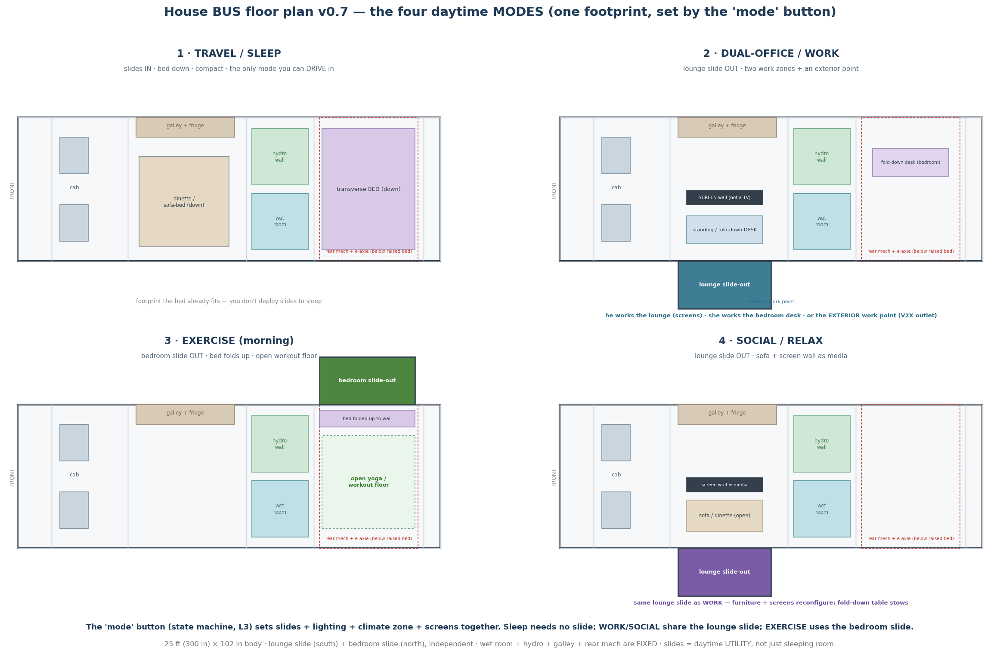
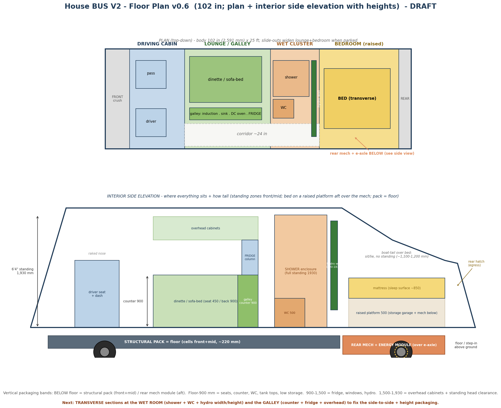
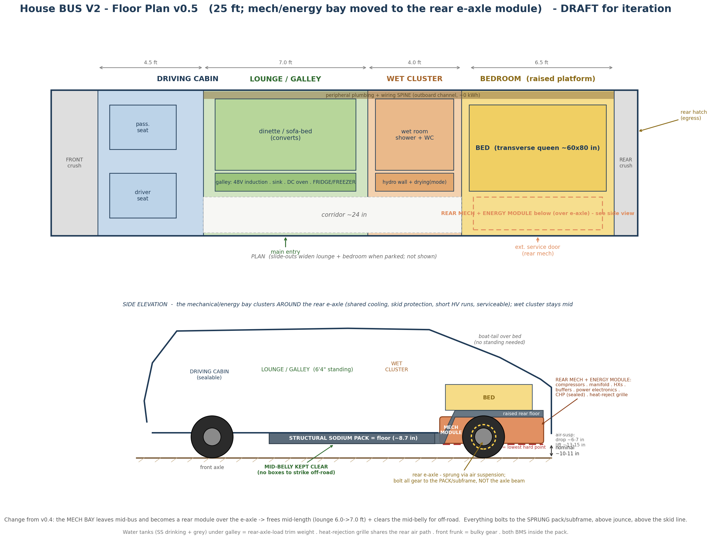
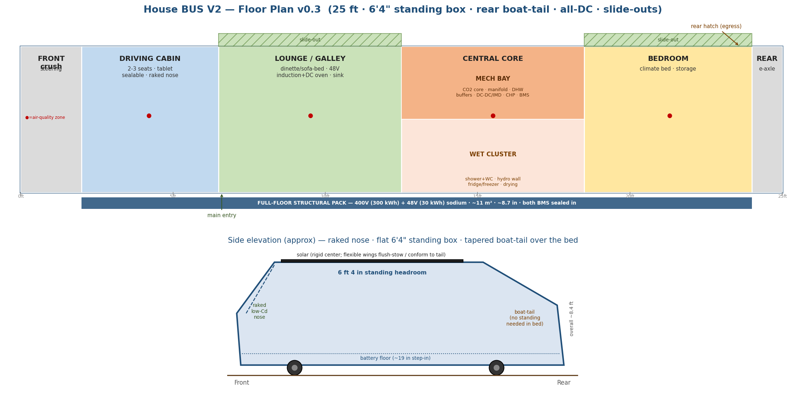

# Bus Layout & Floor Plan - V2 (integrated bus)

**Status:** Layout v0.7 (the four daytime MODES; plan v0.6 + reconfigurable modes)  ·  **Applies to:** Bus **V2** (the bespoke integrated House Bus; V1 = the skoolie repower has its own simpler layout)  ·  **Depends on:** all subsystem tracks + the V1-vs-V2 staging + `07_.../Reconfigurable_Interior_Slide_Out_Modes.md` + the controls state machine

---

## 0.7 — v0.7: the four daytime MODES (2026-07-07)

The v0.6 footprint is fixed; v0.7 shows how it **reconfigures through the day** via the two slide-outs + fold-down furniture. This is the "mobile live-work" positioning (the remote-worker/creator personas, and TJ + wife themselves), and it's what the state machine's **"mode" button** physically does — one control sets **slides + lighting + climate zone + screens** together (ties to `08_.../Controls_Brain_Orchestration_v0_3.md`).

**The two slides are independent and on opposite sides:** the **lounge slide (south)** and the **bedroom slide (north)** — so they balance, deploy separately, and each unlocks a different mode. **Fixed** through every mode: the **wet room + hydro wall + galley/fridge** (mid) and the **rear mech + e-axle** (under the raised bed).

| Mode | Slide | What the space becomes | Mode button also sets |
|---|---|---|---|
| **1 · Travel / Sleep** | **none** (both IN) | bed down, dinette down, compact — **the only mode you can DRIVE in** (all slides in, per the DRIVE-entry interlock) | travel lighting; cab-only climate; screens off |
| **2 · Dual-office / Work** | **lounge OUT (S)** | lounge → standing/fold-down **desk + screen wall (not a TV)**; a **fold-down desk in the bedroom** too — he works the lounge, she the bedroom, or the **exterior work point** (V2X outlet) | task lighting; work-zone climate; screens on as displays |
| **3 · Exercise (morning)** | **bedroom OUT (N)** | bed **folds up to the wall** → open **yoga / workout floor** (TJ's wife's morning routine) | bright even lighting; bedroom-zone climate; screens off/coaching |
| **4 · Social / Relax** | **lounge OUT (S)** | lounge → **sofa/dinette open**; the same screen wall becomes **media** | warm lighting; lounge climate; screens = media |

**Why it matters:** the slides are **daytime utility**, not just night sleeping room — the bed already fits the fixed footprint, so you *don't* deploy slides to sleep. Sliding is about *activity space*: a real two-person mobile office + gym + lounge, with fold-down/stowable furniture so one space serves many modes (the Signature transforming ethos beyond the bathroom). Work and Social **share the lounge slide** (furniture + screens reconfigure); Exercise uses the bedroom slide.

**Open / next (toward v0.8):** slide-floor **live-load structure + seal** spec (a person doing yoga, a desk); the **fold-down desk/table + exercise-floor stow** mechanisms; DC power/data points at the **two interior + one exterior** work zones; transverse sections through a deployed slide (thermal-bridge + travel-position); confirm each mode's guard in the state machine (no DRIVE with a slide out).

---

## 0.6 — v0.6: multi-view packaging (2026-07-03)

Adds the **interior side elevation** so we can read **heights + vertical packaging**, and updates the body to **102 in**. Two panels: **plan** (fore/aft + side-to-side) and **side elevation** (how tall everything is + what stacks above/below).

**Vertical packaging bands (floor = 0):**
- **Below floor:** structural pack (cells, ~220 mm) front+mid; **rear mech + energy module + e-axle** aft (under the raised bed).
- **0–900 mm:** seats, galley counter (900), **extended composting WC** (seat ~460–500; body ~660–710 tall × ~510 W × ~560–610 D — larger chamber for ~2× capacity, ~6–10 wks between empties for 2–3 people), water-tank tops, low storage.
- **900–1,500 mm:** windows, hydro-wall mid.
- **Full-size FRIDGE + FREEZER (galley):** **30 × 60 × 30 in (762 × 1,524 × 762 mm), ~20 cu ft internal** — a real household fridge/freezer for 2–3 people on the road. **Loop-fed advantage:** because cooling comes from the central thermal loop (+ the low-temp circuit for the freezer), there is **no compressor/condenser pack in the cabinet** — just an insulated box + evaporator plate — so it **reclaims the depth normally lost to the compressor bay** and keeps full internal volume in a shallower external unit. Floor-standing; a short overhead cabinet sits above (~1,620–1,900).
- **1,500–1,930 mm:** overhead cabinets + standing head clearance (**6'4" standing** through cab → lounge/galley → wet room).
- **Bedroom:** bed on a **raised platform (~500 mm)** over the mech module; mattress top ~850; **boat-tail roof** above = sit/lie (~1,100–1,200 mm), no standing; rear hatch egress.

**Key fixed heights:** standing 1,930 mm · counter 900 · WC 500 · shower enclosure full-standing 1,930 · hydro wall ~400–1,830 · bed platform 500 / sleep surface ~850.

**Next:** **transverse sections** at the **wet room** (shower + WC + hydro width/height) and the **galley** (counter + fridge + overhead) to fix side-to-side + height packaging per station. *(v0.3–v0.5 images retained.)*

---

## 0. v0.5 — the packaging move (2026-07-03)

**What changed from v0.4:** the **mechanical/energy bay leaves mid-bus** and becomes a **rear module clustered around the e-axle**, under the raised bed platform (see `Eaxle_RideHeight_and_Rear_Packaging.md`). The e-axle already has cooling, skid/impact structure, the fattest cabling, and rear serviceability, and this keeps the **mid-belly clear for off-road**. Two panels now: a **plan** (top-down) and a **side elevation** showing the packaging — pack-as-floor, the pack notching up into the raised rear floor, the rear mech module around the e-axle, the skid low-line, and the ground-clearance band (~10–11 in nominal; ~6–7 dropped; ~13–15 lifted).

**Consequences folded in:**
- **Mid-length freed:** lounge/galley grows 6.0 → **7.0 ft**; the mid "central core" is now just the **wet cluster** (~4.0 ft: shower + WC + hydro wall + dryer-mode).
- **Fridge/freezer** relocates to the **galley** (fed by the core loop); **hydro wall** is vertical; **convenience inverter** on the bath branch.
- **Rear module** (over the e-axle, under the bed): compressors, manifold, plate HXs, buffers, power electronics (DC-DC/PDM/IMD/charger/controls), CHP (sealed), heat-rejection gas-cooler + fan (shares the rear air path). **All bolted to the sprung pack/rear-subframe, never the axle beam**, above jounce, above the skid line.
- **Ext. service door** moves to the rear (mech access); **rear hatch** stays as egress; **peripheral spine** carries plumbing/wiring forward (~0 kWh).
- **Balance watch:** water tanks (SS drinking + grey) stay under the galley as the **rear-axle-load trim weight**; front-cab thermal loop sized for the long run.

### v0.5 zone allocation (front → rear) — 25 ft (300 in)
| Zone | Length | Contents |
|---|---|---|
| Front crush | 2.0 ft | crumple, steering, lighting, frunk; no HV/pressure vessels |
| Driving cabin | 4.5 ft | 2 seats; sealable insulated bulkhead; cab air-handler |
| **Lounge / galley** | **7.0 ft** | dinette/sofa-bed; 48 V induction + DC oven + sink + **fridge/freezer**; slide-out widens |
| **Wet cluster** | **4.0 ft** | shower + composting WC; hydro wall; drying (dryer mode) |
| **Bedroom (raised)** | **6.5 ft** | transverse bed on a raised platform; **rear mech + energy module + e-axle below**; rear hatch egress; slide-out widens |
| Rear crush | 1.0 ft | rear crumple, hitch for the toad |
| **Total** | **25.0 ft** | mech bay is now vertical-under-bed, not a mid-bus room |

*(v0.3/v0.4 images retained: `bus_floorplan_v0_3.png`, `bus_floorplan_v0_4.png`.)*
**Part of:** House BUS subsystem design tracks. Where the now-sized components become a physical arrangement.

---

## 1. Purpose & what changed since v0.1

v0.1 was the first arrangement from the basic subsystem pass. **v0.2 folds in the footprints that have since firmed up:**
- **400 V / 48 V dual-domain structural pack** (~330 kWh: 300 @ 400 V traction + 30 @ 48 V house) - *was* 800 V single pack. Both BMS sealed inside; **roboformed enclosure**, wheel-well-notched; **~11 m^2 single-layer footprint, ~8.7 in thick**; cold-plate cooled off the thermal loop.
- **CO2 dual-circuit thermal core** in the central bay (high-temp 400 V CO2 compressor + low-temp 48 V Secop; gas cooler -> hot water; 18-port manifold; hot/cold buffers; CHP genset).
- **All-DC electrical** - no main 5 kW inverter; 48 / 24 / 12 V + USB-C via point-of-use bucks; a small **~1.5 kW switchable convenience inverter near the bathroom** feeds AC outlets at bath/galley/lounge; galley cooking = **48 V DC induction + DC oven**.

Dimensions are firmer but still provisional; the goal remains the arrangement and its logic.

## 2. The floor plan

Front (cab) at left, rear (bed) at right. **25 ft (locked) x ~98 in body**, slide-outs widening the lounge and bedroom when parked. The **400 V/48 V sodium structural pack is the full floor** (~8.7 in, lowest CG). Side elevation shows the **raked low-Cd nose**, the **flat 6 ft 4 in standing box** (cab -> lounge -> core), and the **boat-tail** tapering over the rear bedroom. *(v0.2 schematic image retained as `bus_floorplan.png`.)*

## 3. Zone allocation (front -> rear) — measured, 25 ft (300 in)

| Zone | Length | Contents |
|---|---|---|
| Front crush / steering | 2.0 ft | crumple structure, steering, front lighting; **no HV/pressure vessels** (Front-End doc) |
| **Driving cabin** | 4.5 ft | 2-3 seats + tablet; **sealable** (insulated bulkhead); integrated into the **raked nose**; cab air-handler off the central core |
| **Main lounge / galley** | 6.0 ft | convertible dinette/sofa-bed; **48 V induction + DC oven** + sink; slide-out widens |
| **Central core** | 6.0 ft | mech bay (top: CO2 core, manifold, DHW+buffers, DC-DC/IMD, CHP, both BMS) + wet cluster (bottom: shower+composting WC, hydroponic wall, fridge/freezer, drying) |
| **Bedroom** | 5.5 ft | climate bed + storage; under the **boat-tail** (sit/lie, no standing); rear emergency hatch; slide-out widens |
| Rear crush / e-axle | 1.0 ft | e-axle, rear crumple, hitch for the toad |
| **Total** | **25.0 ft** | usable interior ~22 ft (cab -> bed) |

## 4. The central mechanical bay (the heart)

Mid-bus, on the structural pack. Holds the **CO2 dual-circuit thermal core** (high-temp 400 V CO2 compressor + low-temp 48 V Secop), the **18-port manifold**, **hot-water gas-cooler tank + hot/cold buffers**, the **power electronics** (Vicor HV->48 V DC-DC, contactors, Bender IMD), the **HV + 48 V distribution**, and the **CHP genset**. Both pack BMS are accessed here. Fire-contained enclosure, reachable from inside and from an **external service door**.

Centre placement keeps coolant loops and HV/48 V runs short and captures recovered heat right where the mid-bus wet cluster uses it.

## 5. The wet / utility cluster (mid-bus)

Bath + closed-loop reticulating shower, composting toilet (urine -> hydroponics), hydroponic green wall, fridge/freezer, drying + dehumid - all around the central bay, so the heat-reuse loop, condensate harvest, and hot water happen in one tight plumbing zone. The CO2 gas cooler's 60-95 C water feeds the shower and the drying right here.

## 6. Electrical distribution (all-DC)

- **No whole-bus AC bus.** 48 V backbone (induction, big pumps, dryer) + 12/24 V + USB-C via point-of-use bucks.
- A small **~1.5 kW switchable convenience inverter near the bathroom** (hair-dryer-driven, off by default) feeds **GFCI AC outlets at bath (primary), galley, and lounge**.
- Shore AC -> DC charger; solar -> 48 V MPPT; DC fast charge (NACS, MCS-ready) -> the 400 V pack.

## 7. Living zones & air quality

Four zones - **driving cabin, main lounge, bath/hydroponics, bedroom** - each with its own air-quality array (CO / CO2 / O2 / humidity / particulates) feeding ventilation logic. Driving cabin seals from the rear so only it is conditioned on the move.

## 8. Slide-outs, roof & underfloor

- **Slide-outs** widen the lounge and bedroom when parked (accepted thermal-bridge trade; winter occasional).
- **Roof:** ~3.5 kW fixed solar + deployable array (to ~5-10 kW); ventilation built into the loop; kept clear.
- **Underfloor:** the 400 V/48 V structural pack spans the floor - lowest CG, stiff, rollover-resistant; ~8.7 in thick with wheel-well notches.

## 9. Circulation & egress

- **Main entry** front by the lounge/cab.
- **Rear emergency hatch + window** at the bed - the second independent exit, so a mid-bus fault never traps you.
- **External service door** to the central bay.
- Clear walk-through aisle; the central core is passed on one side.

## 10. Why this arrangement

Heaviest mass central + low (battery floor) -> stable handling; thermal core central -> shortest loops + best heat harvest; wet cluster central -> one plumbing zone, condensate harvested where made; sleep rear -> quietest, own egress; cab sealable -> condition only the front on the move.

## 11. Open questions (toward v0.3 / measured)

- Galley along the lounge wall vs wrapped into the core.
- Bath vs hydroponics split within the wet cluster (rail-mounted shower/hydro space-share idea).
- Cab seat count (2 vs 3-4); convert/stow.
- Storage volume targets per zone.
- Exact slide-out extents.
- Pack wheel-well notch geometry vs the bay/bath footprint above it.

---
*Layout v0.2 (2026-06-29). V2 integrated bus; firmed footprints folded in (400 V/48 V dual-domain structural pack, CO2 dual-circuit core, all-DC distribution). Dimensions provisional. Next: measured v0.3 once the central-bay and water-inventory volumes are fixed.*
