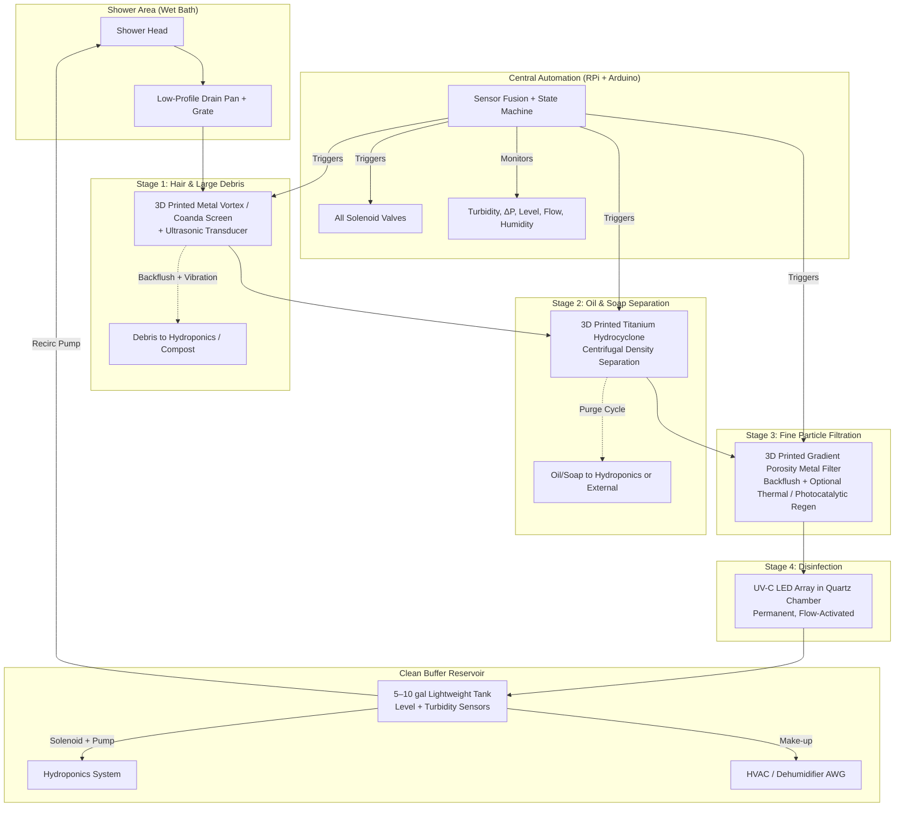

# E-House Bus Conversion: Self-Cleaning Closed-Loop Shower Water Filtration System
## Detailed Design Document from Brainstorming Session

**Created:** June 25, 2026  
**Project Focus:** Electric E-House bus conversion / ground-up design. Emphasis on sourcing parts, engineering analysis, vehicle layout & integration, wiring & power systems, coding & automation, plumbing/house components, and lightweight closed-loop systems.  
**Document Purpose:** Living reference that captures and expands every concept discussed in our conversation. Structured for actionable planning, sourcing, prototyping, and iterative development.  
**Core Non-Negotiables (from discussion):**  
- **Zero consumables** — No paper filters, no replaceable cartridges or media of any kind. Everything must be permanent and regenerable in place.  
- **Fully automated** — Hands-off operation with sensor-driven self-cleaning cycles. Minimal to zero user intervention.  
- **Physics-first design** — Separation via fluid dynamics, density differences, mechanical vibration, backflushing, thermal effects, and surface properties rather than disposable media.  
- **Metal 3D printing enabled** — Custom porous metals, vortex geometries, gradient porosity structures, and monolithic components that traditional manufacturing cannot achieve practically.  
- **Weight minimization** — Drastically reduce fresh + grey water tank mass and volume. Target system-wide water inventory of ~10-15 gallons max at any time.  
- **Integration points:** HVAC/dehumidifier atmospheric water generation (AWG) as primary fresh water source; excess clean water routed to hydroponics or controlled ground discharge; full compatibility with electric bus 12V/48V auxiliary power and future higher-voltage architecture.

---

## Executive Summary

The shower is one of the highest water- and weight-impact systems in a mobile E-House. Traditional approaches require large fresh water tanks, equally large grey water tanks, frequent dumping, and constant resupply — all of which add hundreds of pounds and limit off-grid duration.

Our brainstormed solution is a **real-time closed-loop shower** that:
1. Sources the majority of its water from humidity extracted by the bus HVAC / dehumidifier system (atmospheric water generation).
2. Collects, treats, and recirculates shower water through a multi-stage permanent filtration train.
3. Uses metal 3D printed components for durable, high-performance separation of hair, dirt, oils, soaps, and organics without any consumable media.
4. Self-cleans automatically via backflushing, ultrasonics, and optional thermal/photocatalytic regeneration.
5. Disinfects with permanent UV LEDs.
6. Diverts only the smallest excess volume to hydroponics (beneficial reuse) or a controlled dump.

**Target Outcomes (discussed):**
- 85–95% water recycle rate → effective shower water use drops to ~2–5 gallons per shower instead of 20–30+.
- Total installed system weight target: well under 50 lbs (filters + pumps + small reservoir + electronics).
- Fully automated with Raspberry Pi / Arduino control, sensor feedback loops, and safety interlocks.
- No filter changes, no chemical dosing, no user transfer of water between tanks.
- Seamless integration into the electric bus power, HVAC, plumbing, and future hydroponic systems.

This is ambitious but grounded in real physics (hydrocyclones, vortex separation, Coanda-effect surfaces, porous metal depth filtration, ultrasonics) and existing commercial precedents (RainStick, adapted Showerloop concepts, Infinity Shower, etc.) that we are extending with custom metal 3D printed parts for true zero-consumable, mobile use.

---

## 1. Water Sourcing from Air — HVAC & Dehumidifier / AWG Integration

### 1.1 Core Concept (as brainstormed)
The bus HVAC system and a dedicated dehumidifier pull moist air across cold coils, condensing water vapor. This condensate becomes the primary fresh water input for both drinking (after polishing) and the shower loop. Any surplus from the shower treatment loop is automatically diverted to the hydroponic system or, when necessary, a ground discharge valve.

This approach eliminates or dramatically shrinks the fresh water tank and completely removes the need for a large grey water holding tank — the single biggest weight win discussed.

### 1.2 Engineering Details & Performance Targets
- **Yield Expectations**: In 50–80% relative humidity environments, a compact 30–50 pint dehumidifier or vehicle-scale AWG can deliver 5–15+ gallons per day. In drier conditions the yield drops; the system must gracefully handle this with a backup external fill port.
- **Power Draw**: 200–500 W while running. Perfect for solar surplus or timed operation during high-humidity periods (night, rain, coastal driving). Smart control via humidity sensor prevents wasted energy.
- **Water Quality Path**: Condensate → coarse sediment trap → UV or basic polishing → prioritized for potable use first, then injected into shower reservoir as make-up water.
- **Excess Management**: Clean overflow from the shower reservoir is routed via solenoid valve and small peristaltic or diaphragm pump to the hydroponic nutrient delivery system (plants love the trace nutrients). If hydroponics are full or offline, a secondary valve allows controlled ground discharge (legal compliance required by location).

### 1.3 Vehicle Design & Integration
- **Mounting**: Integrate the dehumidifier module into the existing or upgraded HVAC ducting, or mount a compact standalone unit in a closet/under-seat space. Keep it low and central for weight distribution.
- **Condensate Handling**: Small 12V condensate pump (Little Giant style or equivalent) moves water to a central lightweight buffer tank (RotopaX-style or custom composite 5–10 gal).
- **Insulation**: Aerogel or high-performance closed-cell foam on all water lines and tanks to minimize re-evaporation losses and prevent unwanted condensation inside the bus.
- **Intake Air Quality**: Vehicle air can carry road dust or exhaust — add a cleanable/reusable metal mesh pre-filter on the dehumidifier intake.
- **Backup**: Manual external fill port with quick-connect and basic sediment filter for dry climates or emergency top-ups.

### 1.4 Sourcing Direction (from discussion)
- Premium: Watergen or similar mobile/vehicle AWG units (higher cost but integrated filtration and mineralization).
- Practical: Retrofit existing bus HVAC with condensate collection + high-efficiency 30–50 pint dehumidifier (Midea, Honeywell, Frigidaire, etc.).
- Control hardware: DHT22 or SHT30 humidity/temperature sensor + relay controlled by the central Raspberry Pi.
- Budget range discussed: $300–$2,000 depending on capacity and features.

---

## 2. Closed-Loop Shower Architecture & House Components

### 2.1 High-Level Flow (Text + Mermaid Diagram)
Shower water drains immediately into a shallow collection pan, passes through staged permanent filters, is disinfected, stored in a small clean buffer reservoir, and pumped back to the shower head. Fresh AWG water is added automatically as make-up. Excess clean water goes to hydroponics.



### 2.2 Key House / Vehicle Components
- **Shower Pan & Drain**: Custom or RV wet-bath fiberglass/composite low-threshold pan with integrated grate. Mount in rear or mid-bus wet room. Keep step-in height minimal.
- **Reservoir Tank**: 5–10 gallon food-grade polyethylene or custom lightweight fiberglass/composite tank with internal baffles (anti-slosh for driving). Mount as low as possible for center-of-gravity.
- **Plumbing**: PEX or reinforced silicone hose (flexible, lightweight, freeze-tolerant). All lines sloped for complete drainage. Quick-connect fittings and isolation valves everywhere for serviceability.
- **Weight & Motion Engineering**: Total water mass kept very low. Use multiple smaller tanks if needed instead of one large sloshing mass. Vibration isolation mounts on all pumps, filters, and electronics.
- **Insulation**: Aerogel blankets or spray foam on every water-bearing component — critical for efficiency and to prevent interior condensation in varying climates.

---

## 3. Multi-Stage Permanent Filtration System (Zero Consumables)

This is the heart of the non-negotiable requirements. Every stage must separate contaminants using physics and be self-cleaning via energy or flow manipulation — no paper, no sand, no carbon cartridges, nothing that gets thrown away or replaced on a schedule.

### 3.1 Stage 1 — Hair, Dirt & Large Debris (Mechanical + Coanda / Vortex)
- **Physics**: Water is directed over a 3D printed metal screen or spiral vortex geometry. Hair and larger solids are captured in a side collection chamber while water continues. Coanda-effect surfaces help water cling and flow cleanly while solids are diverted.
- **Self-Cleaning (Automated)**:
  - Primary: Reverse-flow backflush using a small volume of already-clean recirculated water via solenoid valve.
  - Secondary: 40 kHz ultrasonic transducer bonded to the housing vibrates debris loose.
  - Trigger: Differential pressure sensor (ΔP rise indicates partial clog) or scheduled cycle. Debris flushed to hydroponics feed or small external compost point.
- **Metal 3D Printing**: Print the entire screen/vortex assembly in 316L stainless or titanium with precisely controlled 100–500 µm openings, sloped teeth/vanes, and integrated mounting flanges. One monolithic, corrosion-resistant piece.
- **Vehicle Integration**: Mount in a shallow under-floor fiberglass catch basin. Low profile so it does not raise floor height.
- **Sourcing**: Custom print via Xometry, Proto Labs, or Mott Corporation (porous metal experts). Prototype cost range discussed: ~$250–$600.

### 3.2 Stage 2 — Oil, Soap & Emulsified Contaminants (Hydrocyclone / Centrifugal)
- **Physics**: High-velocity vortex created inside a hydrocyclone. Centrifugal force separates lighter oils, soaps, and emulsions to the center or outer wall where they can be skimmed/purged. Purely density-based — no media.
- **Self-Cleaning (Automated)**: Periodic high-speed spin or air injection purge cycle forces the oil layer out a dedicated waste port. Waste goes to hydroponics (trace nutrients) or external holding.
- **Metal 3D Printing**: Print the complete cyclone body and internal vane geometry in lightweight titanium or high-strength stainless. Optimize vane angles and taper for best separation efficiency at low shower flow rates (2–5 GPM).
- **Engineering Notes**: Variable-speed feed pump allows tuning of vortex strength. Size the unit compactly for bus installation.
- **Sourcing**: Either adapt small industrial hydrocyclones (Alfa Laval style) or go fully custom printed. Cost range discussed: ~$200–$500.

### 3.3 Stage 3 — Fine Particles, Organics & Pollutants (Porous Metal Depth Filtration)
- **Physics**: 3D printed metal lattice or honeycomb structures with engineered gradient porosity. Water flows through depth of the material; particles are trapped throughout the volume rather than just on the surface (less prone to rapid clogging than paper).
- **Self-Cleaning & Regeneration (Multiple Physics/Energy Methods)**:
  - **Backflush**: Reverse pump flow for 20–60 seconds — primary everyday method.
  - **Thermal Regeneration**: Embedded resistive heating elements raise the filter to 200–300 °C for several minutes to pyrolyze/oxidize organic buildup. Energy-intensive but very effective; run during peak solar input.
  - **Photocatalytic Assist (Advanced Option)**: TiO₂ coating on the metal lattice + UV light breaks down organics without consumables.
- **Metal 3D Printing Advantage**: Gradient porosity (tighter at inlet face, more open inside), complex internal flow channels for even distribution, integrated ports for sensors or heaters — all in a single durable, corrosion-resistant part. Services like Mott Corp, Sculpteo, or Xometry excel at this.
- **Performance Target**: Major reduction in turbidity and organic load. Multiple backflush cycles before any deep thermal clean is needed.
- **Challenges & Mitigations (discussed)**: Long-term biofilm or scaling — countered by smooth surfaces, frequent auto-cleans, antimicrobial alloy options, and UV downstream.

### 3.4 Stage 4 — Disinfection (UV-C LEDs)
- **Physics**: UV-C light (254 nm or modern LED equivalent) damages DNA/RNA of bacteria, viruses, and pathogens. No chemicals, no residues.
- **Self-Cleaning**: Quartz or UV-transparent chamber designed for periodic high-flow flush. Minimal biofilm risk when combined with upstream filtration and UV itself.
- **Permanent Implementation**: LED arrays rated 10,000+ hours. Flow switch activates LEDs only when water is moving (energy saving).
- **Integration**: Placed immediately after Stage 3 fine filter and before the clean reservoir.
- **Sourcing**: Compact modules inspired by RainStick or generic UV water treatment units. Cost range discussed: ~$100–$250.

---

## 4. Automation, Controls, Coding & Electrical Integration

### 4.1 Hardware Stack (Permanent, Low-Maintenance)
- **Primary Controller**: Raspberry Pi 5 (or Pi 4/5) — runs Python, handles high-level logic, data logging, optional local web dashboard or touchscreen status display.
- **Real-Time Layer**: Arduino or ESP32 for fast sensor/actuator control if needed for responsiveness or power efficiency.
- **Sensors (All Permanent)**:
  - Turbidity sensor (water clarity)
  - Differential pressure sensors (filter health)
  - Ultrasonic or capacitive level sensors (reservoir)
  - Flow rate sensors
  - Humidity + temperature (AWG control)
  - Optional: conductivity or pH trending
- **Actuators**:
  - 12V solenoid valves (backflush routing, excess divert, purge)
  - Variable-speed 12V DC pumps (Shurflo diaphragm or centrifugal)
  - Ultrasonic transducers (40 kHz)
  - Relay/MOSFET drivers for UV LEDs and optional thermal heaters
- **Enclosure**: IP67 waterproof box mounted near wet area with passive cooling or small fan.

### 4.2 Coding & Control Logic (Pseudocode Structure from Discussion)
The system operates as a state machine with continuous monitoring and event-driven self-clean cycles.

```python
# High-level Python structure on Raspberry Pi
import time
from sensors import get_turbidity, get_delta_p, get_level, get_humidity
from actuators import run_pump, set_valve, ultrasonic_on, heater_on, uv_on

STATE = "NORMAL_RECIRC"

while True:
    humidity = get_humidity()
    level = get_level()
    turb = get_turbidity()
    delta_p = get_delta_p()

    # AWG Make-up Water
    if humidity > 55 and level < target_level:
        run_dehumidifier(True)

    # Normal Operation
    if STATE == "NORMAL_RECIRC":
        run_pumps(recirculate=True)
        uv_on(flow_detected=True)
        if turb > turbidity_threshold or delta_p > pressure_threshold:
            STATE = "SELF_CLEAN"

    # Self-Clean Cycle
    if STATE == "SELF_CLEAN":
        # Stage 1
        set_valve("backflush_stage1", True)
        run_pump("reverse", duration=30)
        ultrasonic_on(duration=20)
        set_valve("backflush_stage1", False)

        # Stage 2 Purge
        run_cyclone_high_speed()
        set_valve("purge_oil", True)
        time.sleep(8)
        set_valve("purge_oil", False)

        # Stage 3
        backflush_stage3(duration=45)
        if scheduled_deep_clean_time():
            heater_on(temp=250, duration=300)  # seconds

        # Verify & Resume
        if turb < clean_threshold and delta_p < ok_threshold:
            STATE = "NORMAL_RECIRC"
        else:
            log_issue("Clean cycle incomplete - monitor")
            # Optional: user alert via simple LED or app

    time.sleep(5)  # Main loop interval
```

**Key Software Features to Implement**:
- State machine with safe transitions
- Data logging (local SQLite or CSV) for performance trending and debugging
- Safety interlocks (low-water cutoff, over-temperature on heaters, leak detection via rapid level drop)
- Power-aware scheduling (run heavy cleans during high solar production)
- Minimal user interface (status LEDs + optional button for manual clean cycle or override)

### 4.3 Electrical & Wiring Plan (Bus-Specific)
- **Power Bus**: 12V DC house battery bank (LiFePO4) charged by solar + vehicle alternator/regenerative braking. Future-proof for 48V or higher-voltage auxiliary rails via DC-DC conversion.
- **Wiring Best Practices**:
  - Marine-grade tinned copper wire, properly sized (pumps can draw 5–10 A peaks).
  - Dedicated fused circuits from the main DC distribution panel. Use inline fuses or breakers close to source.
  - Waterproof connectors (Deutsch DT or similar) on all external runs.
  - Shielded signal wiring for sensors; separate from power runs to minimize EMI.
  - Single-point chassis ground to avoid loops.
- **Power Budget (Estimates from Discussion)**:
  - Normal recirculation + UV: 30–60 W
  - Full self-clean cycle (pumps + ultrasonics + optional heater): 80–150 W peak
  - AWG/dehumidifier: 200–500 W when active
  - Daily energy: Well within a 200–400 Ah @ 12V house bank + solar array sized for the rest of the bus loads.
- **Safety**: GFCI where appropriate for wet areas, thermal protection on heaters, emergency stop logic in code.

---

## 5. Vehicle Design, Layout & Integration

- **Wet Bath Location**: Rear corner or mid-bus compact wet room. Integrate shower pan into floor structure where possible for lowest step-in height and best weight distribution.
- **Component Placement**: Filters and reservoir as low and central as possible. Electronics enclosure accessible via hatch but protected from direct spray.
- **Plumbing Strategy**: Short, sloped runs. Clean-out ports at low points. Quick-disconnect fittings for bench testing and future service.
- **Weight & Dynamics**: Every component chosen or printed for minimal mass. Baffled tanks. Vibration isolation on pumps and filter housings. Road testing for sloshing and vibration effects is mandatory.
- **Future Expansion**: Leave plumbing tees and electrical headroom for whole-bus greywater or blackwater recycling later.
- **Insulation & Climate Control**: Aerogel or equivalent on all water components. Tie into bus HVAC for freeze protection if needed in cold climates.

---

## 6. Parts Sourcing, Bill of Materials & Budget

Focus on durable, lightweight, 12V-compatible, marine/RV-grade components. Metal 3D printing is the long-lead, high-value custom element.

**High-Level Bill of Materials (consolidated from discussion)**

| Category                  | Component / Example                                      | Est. Cost (USD)     | Sourcing Notes                              | Notes / Weight |
|---------------------------|----------------------------------------------------------|---------------------|---------------------------------------------|----------------|
| Atmospheric Water         | 30–50 pint dehumidifier or Watergen mobile AWG           | $300 – $2,000      | Amazon, HVAC suppliers, Watergen            | Primary fresh source |
| Stage 1 Pre-Filter        | Custom 3D printed 316L/Ti vortex + Coanda screen         | $250 – $600        | Xometry, Proto Labs, Mott Corp              | Monolithic, permanent |
| Stage 2 Oil Separator     | Custom 3D printed Ti hydrocyclone or mini industrial     | $200 – $500        | 3D print service or Alfa Laval              | Density separation only |
| Stage 3 Fine Filter       | Custom 3D printed gradient porosity metal lattice        | $400 – $800        | Mott, Sculpteo, Xometry                     | Core innovation, regenerable |
| Stage 4 Disinfection      | Compact UV-C LED module + quartz chamber                 | $100 – $250        | RainStick-style or generic UV suppliers     | Permanent LEDs |
| Pumps                     | Shurflo 12V diaphragm/centrifugal (recirc + backflush)   | $80 – $150 each    | West Marine, Amazon, RV suppliers           | Variable speed preferred |
| Valves                    | 12V solenoid valves (brass/plastic, waterproof)          | $20 – $50 each     | Amazon, industrial suppliers                | Multiple needed |
| Sensors                   | Turbidity, ΔP, ultrasonic level, flow, humidity (Adafruit/SparkFun/industrial) | $10 – $60 each | Adafruit, Digi-Key, SparkFun                | All permanent |
| Controller                | Raspberry Pi 5 + relay/MOSFET hat + accessories          | $80 – $150         | Official Raspberry Pi, CanaKit              | + Arduino/ESP32 optional |
| Ultrasonics               | 40 kHz cleaning transducers                              | $15 – $40          | AliExpress, Amazon                          | Bonded to housings |
| Reservoir & Pan           | Custom fiberglass/composite 5–10 gal + shower pan        | $100 – $300        | Custom fab or RV tank suppliers             | Baffled, low CG |
| Plumbing & Fittings       | PEX/silicone hose, quick-connects, isolation valves      | $100 – $200        | Home Depot, Amazon, marine suppliers        | Lightweight & flexible |
| Enclosure & Electrical    | IP67 box, marine wire, fuses, connectors                 | $50 – $100         | West Marine, electrical suppliers           | Waterproof |

**Total Estimated Budget Range**: $2,500 – $6,000 for a complete prototype-to-installed system (varies heavily with how many components are fully custom 3D printed vs off-the-shelf).

**Sourcing Strategy (Recommended Order)**:
1. Acquire pumps, valves, sensors, UV module, Raspberry Pi, and a base dehumidifier first (fastest path to bench prototype).
2. Commission metal 3D printed parts early — they have the longest lead times.
3. Prototype full loop on bench with temporary plastic-printed or off-the-shelf substitutes before ordering final metal parts.
4. Source marine/RV suppliers (West Marine, etc.) for vibration-resistant, waterproof components.

---

## 7. Implementation Roadmap & Immediate Next Steps

**Phase 1 – Detailed Design & CAD (1–2 weeks)**
- Create precise CAD models (FreeCAD or Fusion 360) of vortex screen, hydrocyclone geometry, gradient porosity filter, and all housings.
- Finalize plumbing schematic (P&ID style) and electrical one-line diagram.
- Basic flow/pressure drop calculations or simple CFD simulation.

**Phase 2 – Bench Prototype (2–4 weeks)**
- Build complete recirculation loop on a stand using buckets/tubs.
- Iterate with plastic 3D prints first, then order metal versions.
- Write, test, and refine control code.
- Validate with realistic soapy water + simulated hair/dirt/oil loads.
- Measure: turbidity reduction, flow rates, power draw, recycle percentage, self-clean effectiveness.

**Phase 3 – Vehicle Integration (4–8 weeks)**
- Install in bus: mount everything, run plumbing and wiring, integrate with HVAC and electrical bus.
- Add safety features and basic user interface.
- Road and vibration testing. Adjust mounting and baffling as needed.

**Phase 4 – Validation & Optimization (Ongoing)**
- Extended daily-use testing.
- Water quality verification (test kits then lab samples).
- Tune control parameters and geometries from real data.
- Document SOPs (even if minimal) and create maintenance checklist.

**Immediate Action Items (from our discussion)**
- Decide target shower flow rate (e.g., 2–3 GPM felt like high flow) and reservoir volume.
- Commission first metal 3D print quote for Stage 1 vortex/Coanda screen (need CAD ready).
- Order Raspberry Pi 5 + core sensor/pump kit to start bench coding and testing.
- Research or adapt open-source hydrocyclone vane geometries.
- Confirm local greywater discharge regulations for any planned ground-dump capability.
- Prioritize which stage or subsystem to detail next (e.g., full electrical schematic, specific filter CAD, or hydroponics tie-in plumbing).

---

## 8. Challenges, Risks & Mitigations (Discussed)

- **Clogging / Flow Restriction Over Time**: Frequent automated backflushes + optimized initial geometry. Pressure monitoring with graceful degradation modes.
- **Biofilm & Scaling**: Smooth internal surfaces, UV downstream, periodic high-velocity purges or thermal regeneration. Material selection (antimicrobial alloys where beneficial).
- **Low AWG Yield in Dry Climates**: Backup external fill port + smart prioritization logic. Accept occasional top-ups without system failure.
- **Energy Use During Self-Clean Cycles**: Schedule heavy cleans during peak solar. Use efficient components and variable-speed drives.
- **Soap Chemistry**: Strongly recommend biodegradable, low-residue soaps (Dr. Bronner’s, certain marine/RV formulations) to reduce organic load on filters.
- **Motion & Vibration**: Secure mounting with isolation. Full road testing required.
- **Initial Complexity & Cost**: Phased approach — start simple (mechanical stages + basic backflush) and layer on thermal/photocatalytic sophistication later.
- **Safety & Regulations**: Clear separation of potable vs. non-potable loops. Design for easy switch to full-recycle or holding mode. GFCI and thermal protection.

---

## Conclusion & Living Document Status

This Markdown file consolidates every element we covered in the brainstorming conversation into a single, structured, actionable design reference for the E-House bus shower system. It emphasizes the non-negotiables (zero consumables, full automation, physics-driven separation via metal 3D printed components) while providing concrete engineering, sourcing, coding, wiring, and vehicle integration guidance.

The design is realistic because it builds on proven technologies (hydrocyclones, porous metals, ultrasonics, UV, RainStick-style recirculation) and extends them with modern metal additive manufacturing for true mobile, maintenance-free performance.

**This is a living document.** We can expand any section with:
- Specific CAD file links or screenshots
- Updated BOM with real quotes
- Wiring diagrams (text or image)
- Full Python code repository references
- Test data and iteration logs
- Refined hydroponics integration details

**Ready for next steps?** Tell me which part to drill into first:
- Detailed CAD geometry for one of the metal printed stages?
- Full electrical schematic and wiring diagram?
- Expanded pseudocode or actual starter Python scripts?
- Hydroponics nutrient dosing tie-in plumbing?
- Specific vendor outreach language for metal 3D printing quotes?
- Or any other priority for the electric E-House bus conversion?

We’re building something genuinely innovative here — lightweight, closed-loop, and truly hands-off. Let’s keep iterating.

---

*End of Design Document. All concepts, constraints, stages, automation approaches, sourcing directions, and integration considerations from our conversation are captured and expanded above for ongoing planning and execution.*